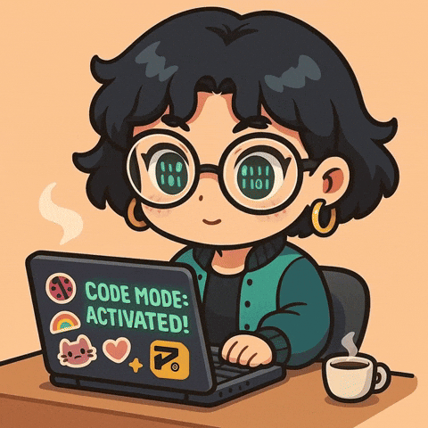

# Hi, I'm Hiba

### Web Developer | Frontend-Focused

Building interfaces, learning by doing, and turning ideas into interactive web experiences.

---

## About Me

I'm a Web Developer focused on Frontend Development.

I enjoy creating clean, interactive and responsive websites while continuously learning new technologies and improving my development skills.

Currently, I'm working mainly with HTML, CSS, JavaScript and React, with a growing focus on animations, modern UI and component-based development.

**Frontend → Backend → Full-Stack**

> Still learning. Still building. Still shipping.

---

## Tech Stack

### Frontend

  

### Tools

  

**Also working with:** GSAP · Font Awesome · Google Fonts

---

## What I'm Currently Doing

- Building frontend projects
- Learning and working with React
- Exploring animations with GSAP
- Creating responsive and interactive interfaces
- Improving my JavaScript and TypeScript skills
- Moving towards backend development

---

## GitHub Stats

---

## My Contributions

---

### Code · Create · Learn · Repeat

